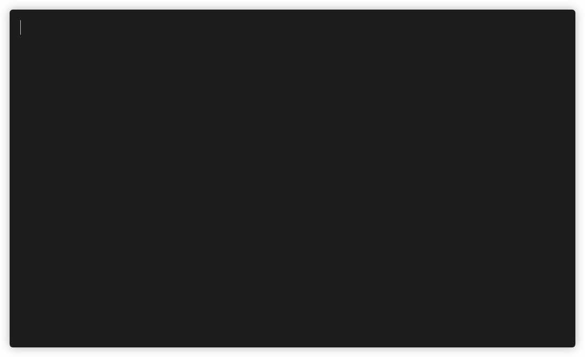
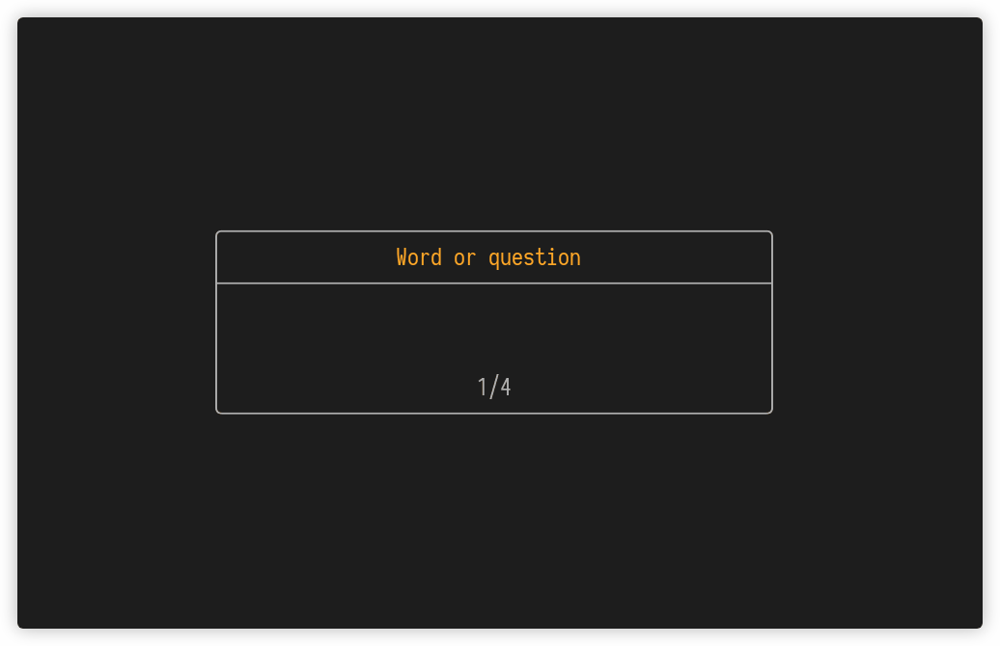
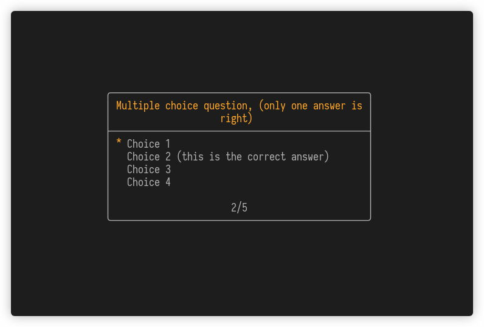
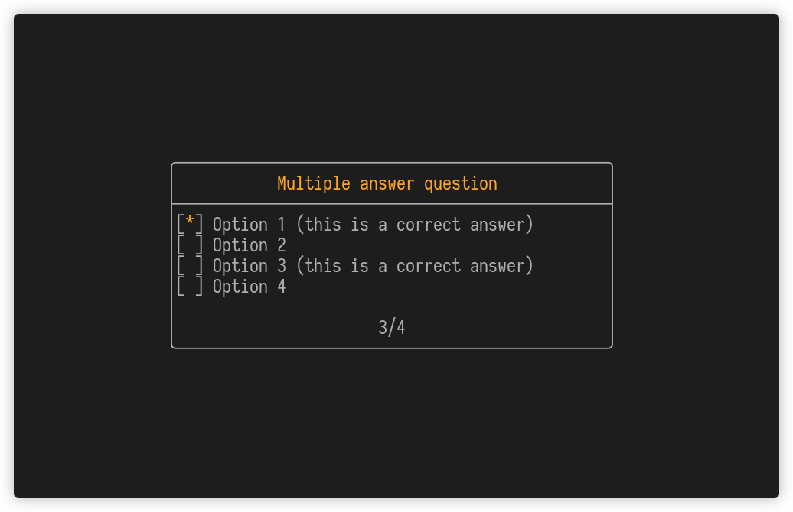
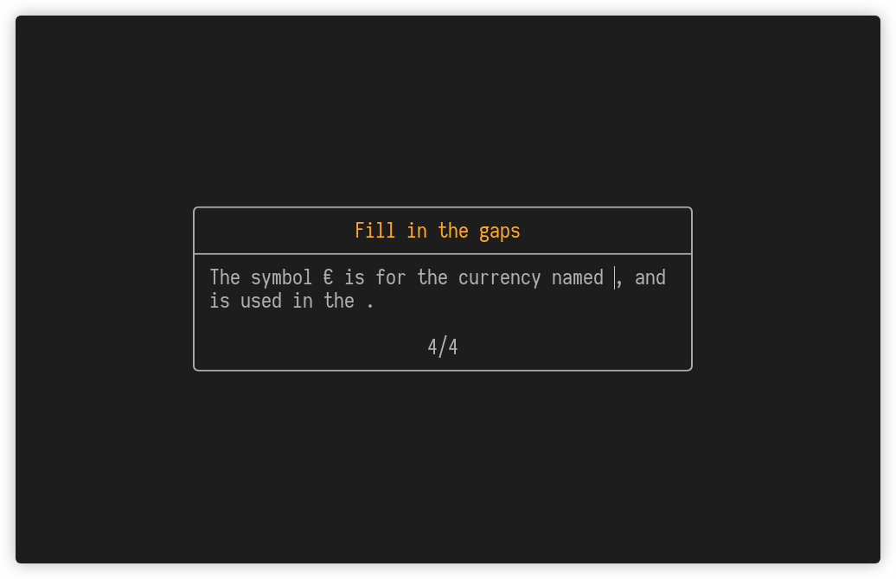
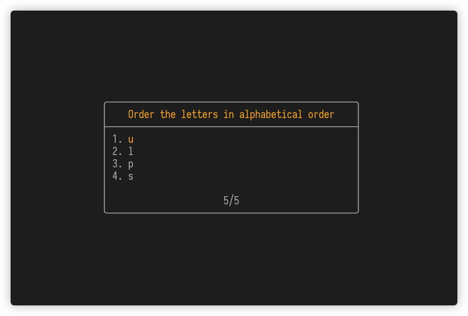

# hascard
[](https://travis-ci.org/Yvee1/hascard) [](https://github.com/Yvee1/hascard/releases) [](https://aur.archlinux.org/packages/hascard/) [](https://hackage.haskell.org/package/hascard)


A minimal commandline utility for reviewing notes. 'Flashcards' can be written in markdown-like syntax.

<p align="center">

</p>

## Contents
- [Installation](#installation)
- [Usage](#usage)
- [Cards](#cards)
  - [Card Types](#card-types)
    - [Definition](#definition)
    - [Multiple choice](#multiple-choice)
    - [Multiple answer](#multiple-answer)
    - [Open question](#open-question)
    - [Reorder question](#reorder-question)
  - [Including files](#including-files)
    - [LaTeX](#latex)
  
- [Miscellaneous info](#miscellaneous-info)

## Installation
Installation on Windows is not possible sadly, aside from WSL. This is because hascard depends on vty which only supports UNIX-like operating systems (this includes macOS).

### Homebrew (for macOS)
For macOS users an installation using homebrew is provided via a custom tap. You can run 
```
brew update
brew install Yvee1/tools/hascard
```

### Binary
Ubuntu and macOS binaries are available under [releases](https://github.com/Yvee1/hascard/releases/). To be able to run it from any directory, it has to be added to the PATH. This can be done by copying it to e.g. the `/usr/local/bin` directory.

### Arch Linux
Thanks to [loki7990](https://github.com/loki7990), hascard is also on the AUR: https://aur.archlinux.org/packages/hascard/.

### Snapcraft
Hascard is also on [snapcraft](https://snapcraft.io/hascard). Installation instructions are on that site. If you already have snap installed you can just install hascard via `sudo snap install hascard`. By default snap applications are isolated from the system and run in a sandbox. This means that hascard does not have permission to read or write any files on the system aside from those under `%HOME/snap/hascard`. To be able to read cards also in other directories under the home directory, hascard makes use of the `home` interface which might need to be enabled manually using `sudo snap connect hascard:home :home`.

**Note**: Because of problems with snap and terminfo, the snap installation does not work directly with somewhat non-standard terminals like st-256 and alacritty. This is because the snap environment does not have the necessary terminfo files for these terminals, but copying the terminfo file from the system is a workaround (see [this comment](https://github.com/Yvee1/hascard/issues/3#issuecomment-680699000)).

### Install from source
Another option is to build hascard and install it from source. For this you can use the Haskell build tool called [stack](https://docs.haskellstack.org/en/stable/README/#how-to-install), or [nix](https://nixos.org/). Then for example clone this repository somewhere:
```
git clone https://github.com/Yvee1/hascard.git
cd hascard
```
and do `stack install hascard` or `nix-build` respectively.

## Usage
Simply run `hascard` to open the main application. Menu navigation can be done with the arrow keys or with the 'j' and 'k' keys. The controls for the different cards can be found at the bottom of the screen by default. This, and a couple other things, can be changed in the settings menu. A deck of cards can be opened using the built-in filebrowser, and recently selected decks will appear in the selection menu. These decks of flashcards are written in plain text, this is explained in section [Cards](#cards). After selecting a deck, some options can be specified, like whether the deck should be shuffled or how many cards should be reviewed.

After finishing a deck, there is an option to create new decks from the correctly answered or incorrectly answered cards, or both. The correct cards of a file named `deck.txt` are stored in `deck+.txt` in the same folder, and the incorrect ones in the file `deck-.txt`. Make sure you do not have files of those names that you want to keep since these _will_ be overwritten.

### CLI
The CLI provides two commands, `run` and `import`. The `hascard run` is essentially the same as just `hascard`, but the `run` command can be given a file to run the application on directly. Instead of specifying the parameters in a menu, they are CLI options.

As an example, say you have a file `deck.txt` with lots of cards in it and you want to review 5 random ones, you can use `hascard run deck -s -a 5`. Here `-s` shuffles the deck and `-a 5` specifies we only want to look at 5 of them.

#### Importing decks
If you have decks in a different format, you might want to convert them into files compatible with hascard. Currently tab-seperated files can be converted to definition or open question cards. For example [Quizlet](https://quizlet.com/) decks can be exported to this format. As an example, the following file
```
aussi	ook
en outre, de plus	bovendien
de même	evenals
```
will become
```
# ook
_aussi_
---
# bovendien
_en outre|de plus_
---
# evenals
_de même_
```
with the command `hascard import input.txt output.txt -r`. More info can be found in the help text at `hascard import --help`.

## Cards
Decks of cards are written in `.txt` or `.md` files. Cards are seperated with a line containing three dashes `---`. For examples, see the [`/cards`](https://github.com/Yvee1/hascard/tree/master/cards) directory. 

### Card Types
In this section the 5 different types of cards are listed, first the text representation is given and after a gif of it is represented in the application.

#### Definition
This is the simplest card, it simply has a title and can be flipped to show the contents. For example the following card
```
# Word or question
Explanation or definition of this word, or the answer to the question.
```
will result in
<p align="center">
  </img>
</p>

#### Multiple choice
This is a typical multiple choice question. The question starts with a `#` and the choices follow. Only one answer is correct, and is indicated by a `*`, the other questions are preceded by a `-`. As an example, the following text

```
# Multiple choice question, (only one answer is right)
- Choice 1
* Choice 2 (this is the correct answer)
- Choice 3
- Choice 4
```

gets rendered as
<p align="center">
  </img>
</p>

#### Multiple answer
Multiple choice questions with multiple possible answers is also possible. Here again the question starts with `#` and the options follow. Preceding each option is a box `[ ]` that is filled with a `*` or a `x` if it is correct. For example

```
# Multiple answer question
[*] Option 1 (this is a correct answer)
[ ] Option 2
[*] Option 3 (this is a correct answer)
[ ] Option 4
```
results in
<p align="center">
  </img>
</p>
                                                           

#### Open question
Open questions are also supported. The words that have to be filled in should be surrounded by underscores `_`. Underscores can also be escaped by `\_` if they are part of the text, like is done in [`cards/analysis3.txt`](https://github.com/Yvee1/hascard/blob/48b5c0751ac72df791402b88c033e05488c9350d/cards/analysis3.txt#L34-L37t). Multiple answer possibilities can also be given by seperating them with vertical bars `|`. As an example, the card

```
# Fill in the gaps
The symbol € is for the currency named _Euro_, and is used in the _EU|European Union_.
```
behaves like this

<p align="center">
  </img>
</p>

#### Reorder question
This is a question where you have to put the elements in the correct order. Each element is preceded by a number indicating their correct place. The elements are rendered in the same order as they are written. For example the card

```
# Order the letters in alphabetical order
4. u
1. l
2. p
3. s
```
will look like
<p align="center">
  </img>
</p>

### Including files
You might want to include an image with a question. Rendering images in the terminal itself is not well supported, so instead an option is made available to let a file be opened automatically when a question is encountered. This can for example be used to include an image or pdf, which is then opened in the default application for that file type (internally the `xdg-open` command is used for linux, and the `open` command for mac). The syntax for including files is similar to how you include images in markdown, and should be placed directly under the header. For example:
```
# What type of fruit is this?

- Apple
* Pear
- Orange
- Banana
```
references the image `pear.jpeg` in the directory of the text file containing the cards. Files can be added to any of the previously listed card types.

#### LaTeX
For reviewing content with mathematical symbols, functionality is included such that LaTeX can be used. Because LaTeX cannot be rendered in the terminal directly, it is first converted to a pdf file with the `pdflatex` command (the pdf is placed in a temporary directory), and then opened in the default pdf viewer application as if the pdf were included directly like mentioned above. LaTeX can be written between three backticks, and should be placed right below the header. For example, the card
``````
# The l^p metric space
```
The space $(\ell^p, d)$ is a metric space, when $d:\ell^p \times \ell^p \rightarrow \mathbb{R}$ is defined as
$$d(x, y) = \left(\sum_{n=1}^\infty |x_n-y_n|^p\right)^{1/p}$$
```
``````
is an empty definition card and just opens a pdf file containing the mathematical statement in another window.

Note that no `\begin{document}`, `\end{document}` or `\documentclass[]{}` should be specified; this is already done automatically. The LaTeX packages "amsfonts", and "mathtools" are currently the only ones that are loaded.

## Miscellaneous info
Written in Haskell, UI built with [brick](https://github.com/jtdaugherty/brick) and parsing of cards done with [megaparsec](https://github.com/mrkkrp/megaparsec). Recordings of the terminal were made using [terminalizer](https://github.com/faressoft/terminalizer). The filebrowser widget was mostly copied from the brick [filebrowser demo program](https://github.com/jtdaugherty/brick/blob/master/programs/FileBrowserDemo.hs). Homebrew and Travis configurations were made much easier by [the tutorial from Chris Penner](https://chrispenner.ca/posts/homebrew-haskell).
