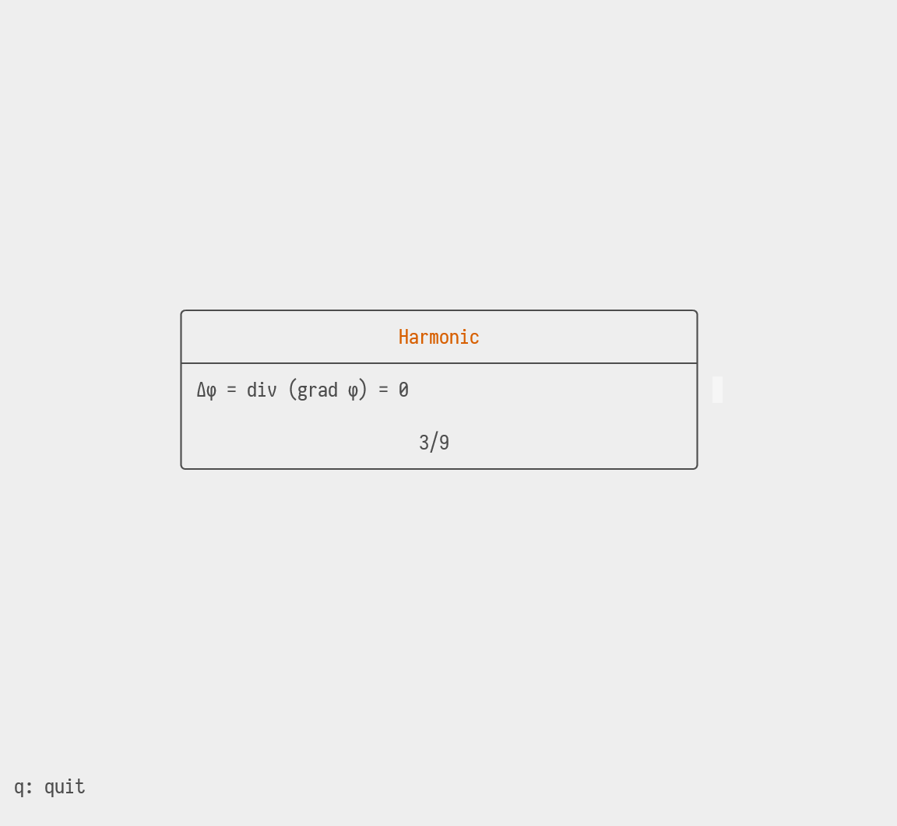

# hascard
An in-progress commandline utility for reviewing notes. 'Flashcards' can be written in markdown-like syntax. Different kind of questions are possible:
- [x] Simple flashcard
- Multiple choice question
  - [x] Single correct answer
  - [ ] Multiple correct answers
- [ ] Fill in the gaps 

